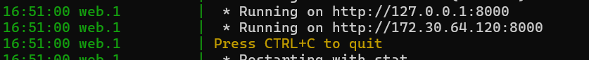
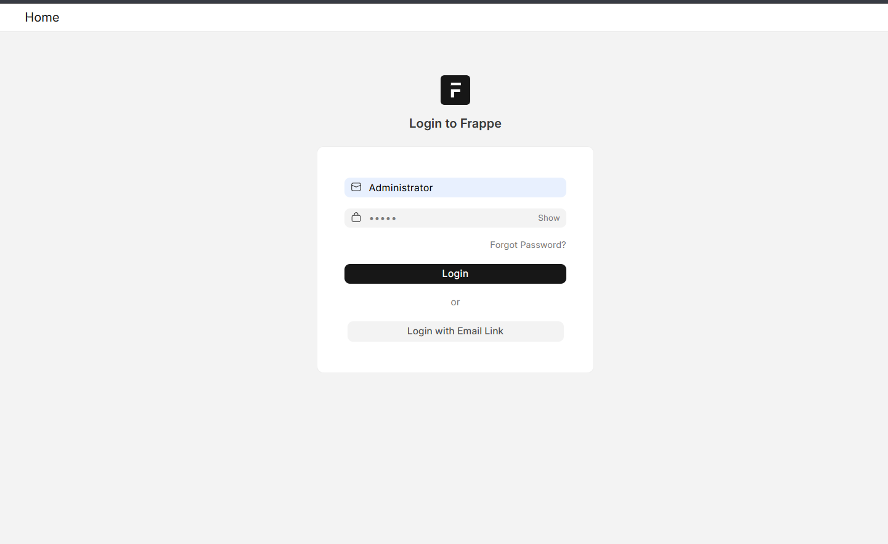
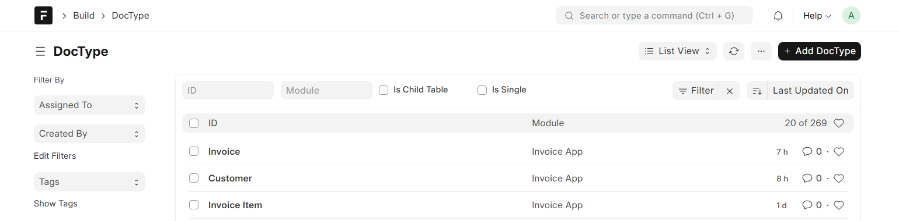
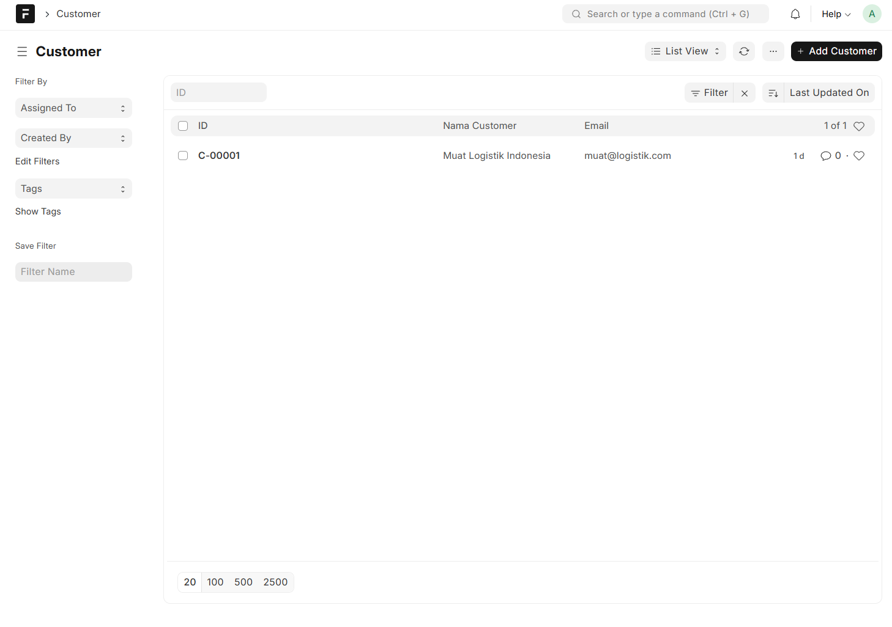
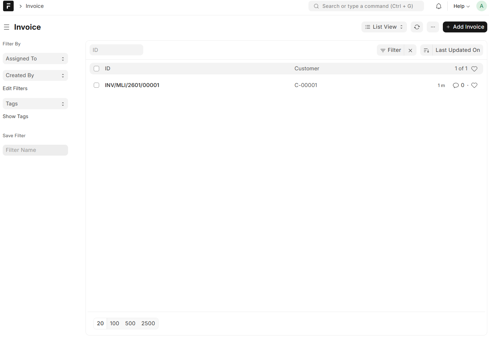
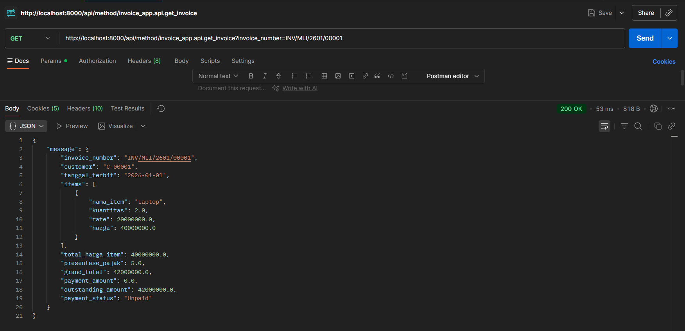
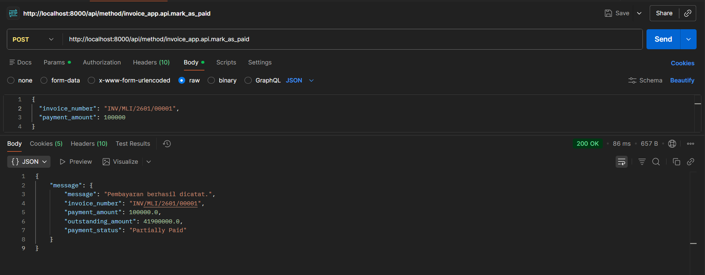
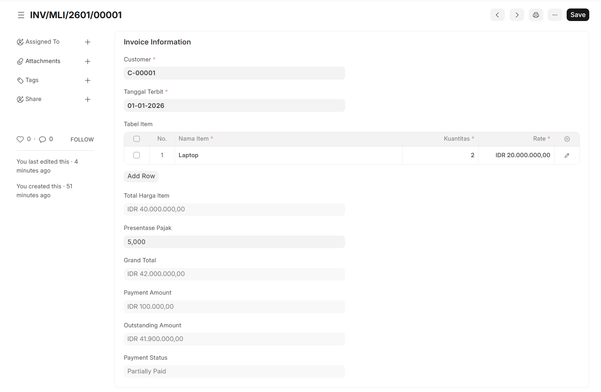
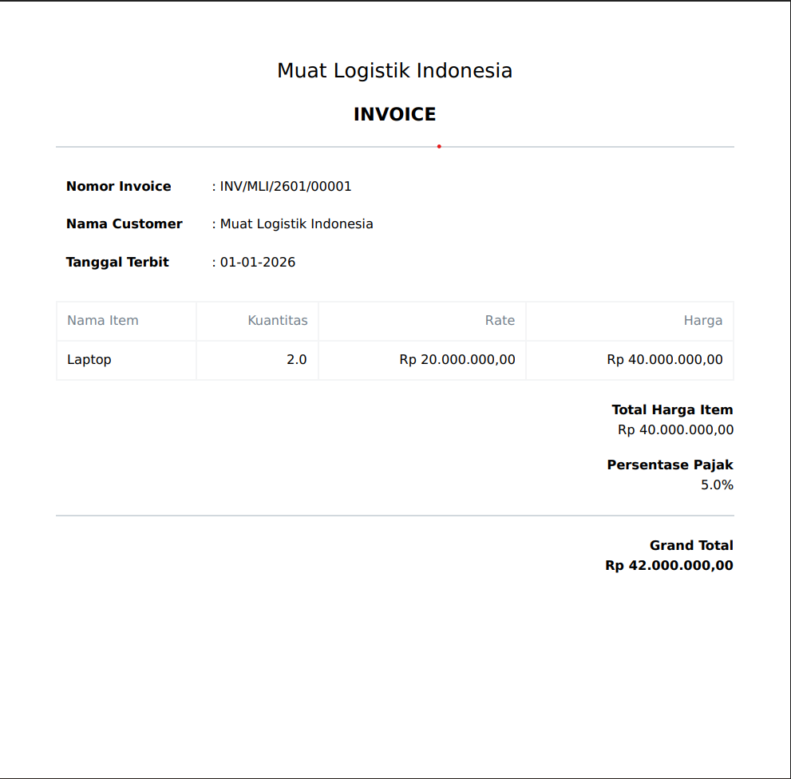

Cara Set-up Frappe Framework:
1. Pastikan Ubuntu sudah tersedia di device
2. Set-up environment untuk frappe, bench, dll
3. Ubuntu akan meminta password untuk kegiatan yang diperlukan agar framework berjalan
4. Jalankan server local untuk mendapatkan IP local(bench start) , Juga bisa install app untuk masuk ke VSC (code .)
5. Ubuntu meminta password untuk Database server local
6. Masuk kedalam IP local dan masukan password server local dengan username "Administrator" 
7. Setelah masuk ke site, klik icon cari dan ketik "DocType" 
8. Cari "Customer", "Invoice" 
9. Kita bisa melihat list list Customer / List list Invoice disana dan dapat melihat preview format print untuk Invoice

Cara Test API Di PostMan:
1. GET
    1. Untuk metode GET kita dapat memasukan link local ini http://localhost:8000/api/method/invoice_app.api.get_invoice?invoice_number=INV/MLI/2601/00001 dan pastikan bahwa Server local sudah nyala (bench Start)
    2. Pilih Metode GET Di postman lalu klik send
    3. Postman akan memberikan suatu return seperti gambar ini 

2. POST
    1. Untuk metode POST kita dapat memasukan link local ini POST http://localhost:8000/api/method/invoice_app.api.mark_as_paid dan pastikan bahwa Server local sudah nyala (bench Start)
    2. Pilih Body -> lalu pilih RAW (JSON) dan masukan Invoice Number dan Payment
        {
            "invoice_number": "INV/MLI/2601/00001",
            "payment_amount": 100000
        }
    3. Pilih Metode POST Di postman lalu klik send
    4. Postman akan memberikan suatu return seperti gambar ini 
    5. Dan otomatis Value dari invoice number akan berubah seperti ini 

Design Decisions:
- autoname(self)
    Metode ini mengatur nama Invoice secara otomatis ketika dokumen dibuat. Dengan mengambil inisial Customer & inisial Issue Date dan digabungkan menjadi `INV/{self.customer_initials}/{self.issue_date_yymm}/.#####` (.####, merupakan format untuk membuat nomor urut otomatis)

- Separation of Concerns (Helper Functions)
  Logika dipisahkan ke dalam beberapa method  untuk meningkatkan readability dan maintainability. Seperti:
  1. `_calculate_totals` untuk menghitung(total harga item, pajak,      grand_total dan outstanding), 
  2. `_update_payment_status` untuk update status pembayaran berdasarkan outstanding dan grand_total, 
  3. `_get_issue_date_yymm` untuk converts tanggal issue menjadi format YYMM,
  4. `_get_customer_initials` untuk converts setiap awalan hurup di setiap kata 
  
- Automatic Field Population
  Field seperti `customer_name`, `customer_initials`, dan `issue_date_yymm` diisi otomatis untuk mengurangi input manual dan menghindari human error.

- Use of `before_save()`
  Mengisi nama customer, menghitung harga tiap item, menghitung total invoice dan menentukan status pembayaran. Menjalankan beberapa proses otomatis sebelum data disimpan.

Berikut adalah Screenshoot Print Format
